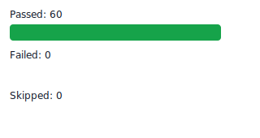

# 🚀 Playwright Automation Portfolio

[](https://github.com/TheKalid/playwright-architecture-demo/actions)
This opens GitHub Actions, where you can see E2E test runs, pipeline history, and execution results.
---

## 📌 Overview

This project is an **End-to-End Test Automation Framework** built with Playwright and integrated with CI/CD using GitHub Actions.

It demonstrates how automated tests can run reliably in a continuous integration environment with reporting and debugging capabilities.

---

## ⚙️ Tech Stack

* 🧪 Playwright
* 💻 TypeScript
* ⚡ GitHub Actions
* 🌐 Node.js

---

## 🎯 Key Features

* ✅ End-to-End UI Testing
* 🔁 Automatic execution on push & pull requests
* 📊 HTML reports with detailed results
* 📸 Screenshots on failure
* 🎥 Video recording for debugging
* 🧠 Trace viewer for deep analysis
* ⏱ Parallel test execution

---

## 🤖 CI/CD Pipeline

This project uses GitHub Actions to:

1. Install dependencies
2. Install Playwright browsers
3. Run automated tests
4. Generate reports
5. Upload results as artifacts

📌 Tests run on:

* Push to `main`
* Pull Requests
* Scheduled executions

---

## ▶️ Run Locally

```bash
npm install
npx playwright test
```

To open the report:

```bash
npx playwright show-report
```

---

## 📊 Test Report

After each run, an HTML report is generated.

👉 Download it from: **Actions → Artifacts → playwright-report**

---

## 📈 Live Test Results

This chart is generated automatically from Playwright JSON results in CI.



---

## 🎥 Demo


---

## 📂 Project Structure

```
.
├── tests/
├── pages/
├── utils/
├── playwright.config.ts
└── .github/workflows/
```

---

## 💡 What This Project Demonstrates

* Test automation with Playwright
* CI/CD integration
* Debugging with traces, videos, and screenshots
* Scalable and maintainable test architecture

---

## 👨‍💻 Kalid M

SDET focused on building reliable automation solutions.

---
